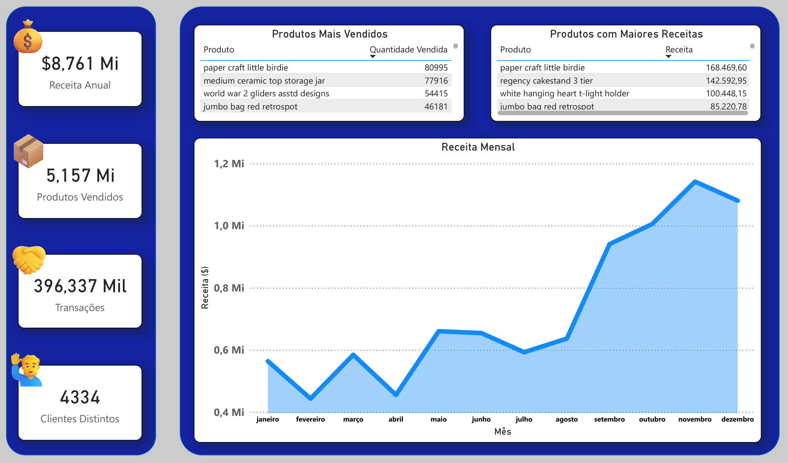
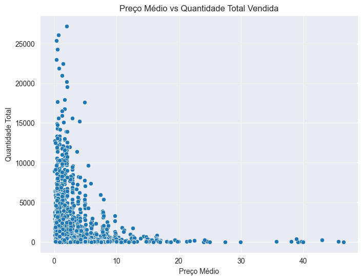
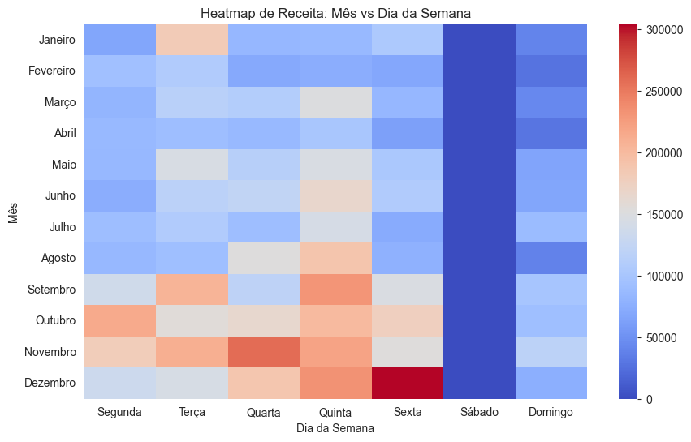
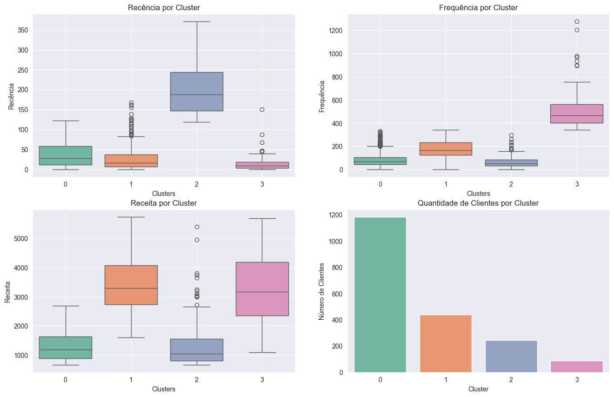

# Pricing, Customer Behavior and Recommendation Strategies

Este repositório é um compilado de estratégias fundamentadas em **dados, estatística, economia e machine learning**, com o objetivo principal de resolver problemas complexos na área de **Pricing** (precificação).

O projeto aborda desde a limpeza e preparação dos dados até a implementação de modelos de sensibilidade de preço, análise de sazonalidade, classificação de clientes e sistemas de recomendação.

## 💾 Dataset:

* `Fonte`: [UC Irvine Machine Learning Repository](https://archive.ics.uci.edu/dataset/352/online+retail)
* `Descrição`: Registro de vendas de um site de varejo contendo mais 500 mil registros de compras de mais 4000 clientes em 37 países.

## 📊 Resultados Principais:

### 📈 Dashboard no ***POWER BI***:
Em `reports/`, é possível encontrar o arquivo .pbix para visualição no POWER BI.

### 🛒 Distribuição de produtos de acordo com preço médio e a demanda:
Foi observado uma relação inversa entre preço e demanda:
* Menores preços -> Maior Demanda;
* Maiores preços -> Menor Demanda;
  

### 📅 Distribuição de receita por dia de cada mês com maiores vendas:
De acordo a distribuição de vendas anuais, os meses com maiores receitas foram:

`Setembro, Outubro, Novembro e Dezembro`

### 📅 Heatmap que indica quais dias da semana de cada mês receberam mais receita:

Além dos meses com maior receita, também podem ser considerados os dias da semana com maior receita:

`Segunda à Sexta`

### 👨‍👩‍👧‍👦 Distribuição RFM por cluster de clientes:

Utilizando Kmeans, foi observado 4 clusters de clientes (0, 1, 2 e 3), sendo os clusters ***1 e 3*** os mais relevantes, pois:

`O grupo de clientes ideal seria aquele que faz compras regularmente (recência baixa), é um cliente 'fiel' (frequência alta) e já trouxe bastante receita (receita alta).`

## 📁 Estrutura do Repositório:

*   `data/`: Contém os conjuntos de dados utilizados nas análises.
*   `notebooks/`: Jupyter Notebooks com o passo a passo de cada estratégia e modelo.
*   `reports/`: Contém relatórios e visualizações obtidas a partir das análises.
*   `src/`: Scripts Python para automação de limpeza e criação de datasets.

## 📚 Conteúdo dos Notebooks:

A análise está dividida em seis etapas principais:

1.  **Limpeza de Dados (`1_cleaning_data.ipynb`)**: Processamento inicial e preparação da base de dados.
2.  **Sensibilidade de Preço (`2_pricing_sensitivity.ipynb`)**: Análise de como variações no preço impactam a demanda (Elasticidade-Preço).
3.  **Trade-off de Preço (`3_price_trade_off.ipynb`)**: Estudo do equilíbrio entre volume de vendas e receita.
4.  **Efeito de Sazonalidade (`4_seazonality_effect.ipynb`)**: Identificação de padrões temporais.
5.  **Classificação de Clientes (`5_customer_classification.ipynb`)**: Clusterização de clientes para estratégias de vendas personalizadas.
6.  **Recomendação de Produtos (`6_product_recommendation.ipynb`)**: Recomendação de produtos com base no comportamento de compra.

## 🛠️ Tecnologias Utilizadas:

*   **Linguagem:** Python
*   **Bibliotecas de Dados:** Pandas, NumPy
*   **Visualização:** Matplotlib, Seaborn
*   **Machine Learning:** Scikit-learn
*   **Ambiente:** Jupyter Notebook

## 👤 Autor

**Diego de Lima Fernandes**
- LinkedIn: [linkedin.com/in/diegulus](https://www.linkedin.com/in/diegulus/)
- GitHub: [@PhysicTeacherCode](https://github.com/PhysicTeacherCode)
- Email: diego196095@gmail.com
